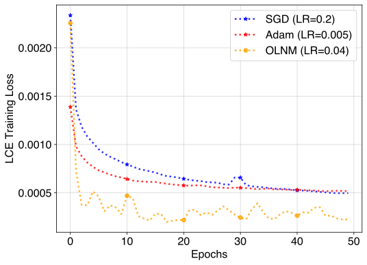

# Delayed Mini-Batch Sampling Method for Accelerated Training

Official implementation of the paper **"Delayed Mini-Batch Sampling Method for Accelerated Training"** by **Tuan Nguyen** and **Stephen Becker** (University of Colorado Boulder).

---

## Overview

In standard Stochastic Gradient Descent (SGD), a new minibatch of samples is drawn at every single gradient step. This repository introduces a novel approach: re-using the same minibatch for several consecutive gradient steps.

While counterintuitive, this "delay" allows us to temporarily treat the optimization problem as deterministic. This shift enables the application of highly efficient optimization methods, such as Nesterov acceleration, which are typically more difficult to tune in purely stochastic environments.

### Why does this work?
Our method is inspired by time-varying optimization. By utilizing "stale" information strategically, we can achieve faster convergence. Our research provides the mathematical analysis to validate this viewpoint and demonstrates that this method consistently outperforms optimally tuned SGD and Adam in both training loss and testing accuracy.

---

## Repo Structure

The code is organized to mirror the sections of the paper:

| Directory | Description |
| :--- | :--- |
| `numerical/` | Contains scripts demonstrating the core conceptual mechanics of the algorithm. |
| `logistic-reg-mnist/` | Experiments using a simple model on the MNIST dataset comparing our solution against SGD and Adam. |
| `cnn-fmnist/` | Deep learning implementation using a Convolutional Neural Network on Fashion-MNIST to validate performance in deep architectures. |

---

## Experiments

We evaluated the Delayed Mini-Batch Sampling method on multiple datasets:
1.  MNIST: Using both squared and cross-entropy loss.
2.  CIFAR-10: Using a CNN architecture.
3.  Fashion-MNIST: Validating the deep learning approach.

In all cases, the proposed method showed superior performance in terms of both minimizing training loss and maximizing testing accuracy compared to heavily tuned baseline optimizers.

---

## Authors
Tuan Nguyen & Prof. Steven Becker - [Applied Mathematics, CU Boulder](https://www.colorado.edu/amath/)